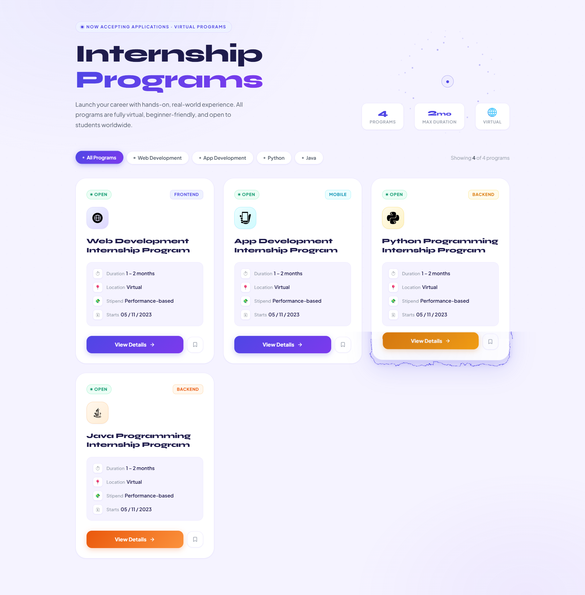

<div align="center">

<!-- ╔══════════════════════════════════════════════════════════════╗ -->
<!--                   ANIMATED WAVE HEADER                         -->
<!-- ╚══════════════════════════════════════════════════════════════╝ -->


<!-- ╔══════════════════════════════════════════════════════════════╗ -->
<!--                  ANIMATED TYPING TAGLINE                       -->
<!-- ╚══════════════════════════════════════════════════════════════╝ -->


<br/>

<!-- ╔══════════════════════════════════════════════════════════════╗ -->
<!--                      CTA BUTTONS                               -->
<!-- ╚══════════════════════════════════════════════════════════════╝ -->

[](#)
[](#)
[](https://reactbits.dev)

<br/>

<!-- ╔══════════════════════════════════════════════════════════════╗ -->
<!--               ANIMATED SKILL / TECH ICON BADGES                -->
<!-- ╚══════════════════════════════════════════════════════════════╝ -->


<br/><br/>


</div>

<br/>

<!-- ━━━━━━━━━━━━━━━━━━━━━━━━━━━━ DIVIDER ━━━━━━━━━━━━━━━━━━━━━━━━━━━━ -->


<br/>

<!-- ╔══════════════════════════════════════════════════════════════╗ -->
<!--                      SITE PREVIEW                              -->
<!-- ╚══════════════════════════════════════════════════════════════╝ -->

<div align="center">

[](https://future-foundry.netlify.app/)

*Click the badge above to visit the live site ↑*

</div>

<br/>

<!-- ━━━━━━━━━━━━━━━━━━━━━━━━━━━━ DIVIDER ━━━━━━━━━━━━━━━━━━━━━━━━━━━━ -->


<br/>

<!-- ╔══════════════════════════════════════════════════════════════╗ -->
<!--                     ABOUT THE PROJECT                          -->
<!-- ╚══════════════════════════════════════════════════════════════╝ -->

## 🚀 About The Project

A **modern, fully responsive Internship Programs listing page** built with pure HTML, CSS, and JavaScript — designed to showcase virtual internship opportunities with a premium light-theme UI. Powered by hand-ported **ReactBits animation effects** including Electric Border, Glare Hover, Click Spark, and Antigravity — all implemented in vanilla JS with zero dependencies.

> 💡 Crafted as a professional web development assignment — pushing well beyond the brief to deliver a production-quality, interaction-rich experience.

<br/>

<div align="center">

| 🎨 Design System | ⚡ Animations | 🔍 Filtering | 🖱️ Interactions |
|:---:|:---:|:---:|:---:|
| Indigo + Violet light theme with soft lavender bg | 4 ReactBits effects ported to vanilla JS | Live category filter with animated transitions | Custom cursor · Click sparks · Antigravity icons |

</div>

<br/>

<!-- ━━━━━━━━━━━━━━━━━━━━━━━━━━━━ DIVIDER ━━━━━━━━━━━━━━━━━━━━━━━━━━━━ -->


<br/>

<!-- ╔══════════════════════════════════════════════════════════════╗ -->
<!--                        FEATURES                                -->
<!-- ╚══════════════════════════════════════════════════════════════╝ -->

## ✨ Features

<br/>

| 🎨 UI & Design | ⚙️ Functionality | 🌀 Animations & Effects |
|:---|:---|:---|
| Soft lavender light-theme bg with indigo palette | **Live filter pills** — show/hide cards by category | **Electric Border** — turbulence SVG filter on card hover |
| `Plus Jakarta Sans` + `Syne` premium typography | Animated card count updates on filter change | **Glare Hover** — mouse-tracked radial light on cards |
| Per-category color coding (Web · App · Python · Java) | Bookmark / Save button with toggle state | **Click Spark** — indigo particle burst on every click |
| Stats bar in header (Programs · Duration · Virtual) | Working external links on all CTA buttons | **Antigravity** — icons float away from cursor |
| Glassmorphism meta info tray inside each card | Scroll reveal — staggered card entrance animation | **Dot Grid background** — cursor-reactive particle field |
| Color-accent gradient buttons per card | Empty state shown when no filter matches | **3D tilt** — perspective transform on card hover |
| Animated live "Open" badge with pulse dot | SVG icons from local `/public/` folder | Custom cursor ring with hover-enlarge behavior |

<br/>

### 📌 Internship Cards Included

```
Web Development  ·  App Development  ·  Python Programming  ·  Java Programming
```

<br/>

<!-- ━━━━━━━━━━━━━━━━━━━━━━━━━━━━ DIVIDER ━━━━━━━━━━━━━━━━━━━━━━━━━━━━ -->


<br/>

<!-- ╔══════════════════════════════════════════════════════════════╗ -->
<!--               REACTBITS ANIMATION DETAILS                      -->
<!-- ╚══════════════════════════════════════════════════════════════╝ -->

## ⚡ ReactBits Effects — Implementation Details

> All four effects are faithfully ported from [ReactBits.dev](https://reactbits.dev) and customized for a light indigo theme using **pure vanilla JavaScript** — no React, no npm.

<br/>

<div align="center">

| Effect | Source | Customization |
|:---|:---|:---|
| 🔌 **Electric Border** | [reactbits.dev/animations/electric-border](https://reactbits.dev/animations/electric-border) | SVG `feTurbulence` + `feDisplacementMap` filter on card hover; indigo glow |
| ✨ **Glare Hover** | [reactbits.dev/animations/glare-hover](https://reactbits.dev/animations/glare-hover) | Mouse-tracked radial gradient overlay; soft indigo tint for light bg |
| 🪐 **Antigravity** | [reactbits.dev/animations/antigravity](https://reactbits.dev/animations/antigravity) | Card icons repel from cursor proximity; scale + translate on approach |
| 💥 **Click Spark** | [reactbits.dev/animations/click-spark](https://reactbits.dev/animations/click-spark) | Canvas particle burst on every click; indigo/violet/white palette |

</div>

<br/>

<!-- ━━━━━━━━━━━━━━━━━━━━━━━━━━━━ DIVIDER ━━━━━━━━━━━━━━━━━━━━━━━━━━━━ -->


<br/>

<!-- ╔══════════════════════════════════════════════════════════════╗ -->
<!--                        TECH STACK                              -->
<!-- ╚══════════════════════════════════════════════════════════════╝ -->

## 🛠️ Tech Stack

<br/>

<div align="center">


<br/><br/>

| Layer | Technology | Purpose |
|:---:|:---|:---|
| 🏗️ **Structure** | HTML5 | Semantic, accessible page markup with `data-category` filter attributes |
| 🎨 **Styling** | CSS3 | Custom properties, glassmorphism, gradient system, responsive grid |
| ⚡ **Interactivity** | JavaScript ES6 | DOM filter logic, canvas animations, cursor tracking, sparks |
| 🌀 **Animations** | [ReactBits](https://reactbits.dev) (ported) | Electric Border · Glare Hover · Antigravity · Click Spark |
| 🖼️ **Background** | Canvas API | Dot-grid particle field with cursor-reactive repel physics |
| 🔤 **Fonts** | [Google Fonts](https://fonts.google.com/) — Plus Jakarta Sans & Syne | Premium modern typography |
| 🎯 **Icons** | [SVGRepo](https://www.svgrepo.com/) + local `/public/` SVGs | Web · App · Python · Java program icons |
| 🔷 **Favicon** | Local `logo.svg` | Custom browser tab icon |

</div>

<br/>

<!-- ━━━━━━━━━━━━━━━━━━━━━━━━━━━━ DIVIDER ━━━━━━━━━━━━━━━━━━━━━━━━━━━━ -->


<br/>

<!-- ╔══════════════════════════════════════════════════════════════╗ -->
<!--                     PROJECT STRUCTURE                          -->
<!-- ╚══════════════════════════════════════════════════════════════╝ -->

## 📁 Project Structure

```
future-foundry/
│
├── 📂 public/                    ← Static assets served directly
│   ├── 🌐 Web-Development.svg    ← Icon for Web Dev card
│   ├── 📱 App-Development.svg    ← Icon for App Dev card
│   ├── 🐍 Python.svg             ← Icon for Python card
│   ├── ☕ Java.svg               ← Icon for Java card
│   └── 🔷 logo.svg              ← Browser tab favicon
│
├── 📂 src/                       ← Source files
│   └── 📄 index.html       ← Main page (all HTML + CSS + JS)
│
└── 📂 lib/                       ← Library / utility files (if any)
```

<br/>

<!-- ━━━━━━━━━━━━━━━━━━━━━━━━━━━━ DIVIDER ━━━━━━━━━━━━━━━━━━━━━━━━━━━━ -->


<br/>

<!-- ╔══════════════════════════════════════════════════════════════╗ -->
<!--                      GETTING STARTED                           -->
<!-- ╚══════════════════════════════════════════════════════════════╝ -->

## 🚀 Getting Started

**1. Clone the repository**

```bash
git clone https://github.com/aryansengar007/future-foundry.git
```

**2. Navigate into the project folder**

```bash
cd future-foundry
```

**3. Launch in your browser**

```bash
# Option A — Open directly in browser:
open src/index.html

# Option B — Use VS Code Live Server (recommended for SVG icon loading):
# Right-click src/index.html → "Open with Live Server"
```

> ✅ No npm install. No build step. No bundler. No configuration needed.

> ⚠️ **Note:** Open via a local server (Live Server / VS Code) rather than double-clicking the file directly — this ensures the `../public/*.svg` icon paths resolve correctly across all browsers.

<br/>

<!-- ━━━━━━━━━━━━━━━━━━━━━━━━━━━━ DIVIDER ━━━━━━━━━━━━━━━━━━━━━━━━━━━━ -->


<br/>

<!-- ╔══════════════════════════════════════════════════════════════╗ -->
<!--                       DESIGN DECISIONS                          -->
<!-- ╚══════════════════════════════════════════════════════════════╝ -->

## 🎨 Design Decisions

<br/>

<div align="center">

| Decision | Reasoning |
|:---|:---|
| **Soft lavender `#F5F3FF` background** | Warmer than stark white — premium feel without harshness |
| **Indigo + Violet gradient system** | Consistent brand identity across buttons, borders, sparks |
| **Per-card color accents** (indigo/cyan/amber/orange) | Each program has a visual identity — makes scanning faster |
| **Plus Jakarta Sans + Syne pairing** | Jakarta Sans for body readability; Syne for bold, modern headings |
| **`data-category` + `data-filter` architecture** | Clean, scalable filter system — add new cards in seconds |
| **Canvas-based particles & sparks** | Zero dependency — full control over physics and color |
| **3px top-stripe on card hover** | Subtle premium detail that signals interactivity |
| **Stats bar in header** | Communicates value instantly before user reads any card |

</div>

<br/>

<!-- ━━━━━━━━━━━━━━━━━━━━━━━━━━━━ DIVIDER ━━━━━━━━━━━━━━━━━━━━━━━━━━━━ -->


<br/>

<br/>

<!-- ━━━━━━━━━━━━━━━━━━━━━━━━━━━━ DIVIDER ━━━━━━━━━━━━━━━━━━━━━━━━━━━━ -->


<br/>

<!-- ╔══════════════════════════════════════════════════════════════╗ -->
<!--                    ACKNOWLEDGEMENTS                            -->
<!-- ╚══════════════════════════════════════════════════════════════╝ -->

## 🙌 Acknowledgements

- ⚡ Animation concepts from [ReactBits.dev](https://reactbits.dev) — Electric Border · Glare Hover · Antigravity · Click Spark
- 🖼️ SVG icons sourced from [SVGRepo](https://www.svgrepo.com/)
- 🔤 Typography via [Google Fonts](https://fonts.google.com/) — Plus Jakarta Sans & Syne
- 🌊 README header/footer renders via [Capsule Render](https://capsule-render.vercel.app/)
- ⌨️ Typing animation via [Readme Typing SVG](https://readme-typing-svg.demolab.com/)
- 🛡️ Badges via [Shields.io](https://shields.io/) & [Skill Icons](https://skillicons.dev/)

<br/>

<!-- ╔══════════════════════════════════════════════════════════════╗ -->
<!--                     AUTHOR & CONNECT                           -->
<!-- ╚══════════════════════════════════════════════════════════════╝ -->

## 👨‍💻 Author

<div align="center">

### Aryan Sengar

🎓 **B.Tech CSE (AI & ML)** &nbsp;|&nbsp; 🌍 Gurgaon, India
&nbsp;|&nbsp; Frontend Developer & UI Enthusiast

<br/>

[](https://www.linkedin.com/in/aryan-sengar-786b96290/)
[](https://github.com/aryansengar007)

</div>

<br/>

<!-- ╔══════════════════════════════════════════════════════════════╗ -->
<!--                   ANIMATED WAVE FOOTER                         -->
<!-- ╚══════════════════════════════════════════════════════════════╝ -->


<div align="center">

© 2025 **Aryan Sengar** — All Rights Reserved. Unauthorized copying is strictly prohibited.

<br/>

*If you found this project helpful or inspiring, consider leaving a* ⭐ *— it means a lot!*

</div>
